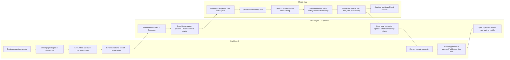
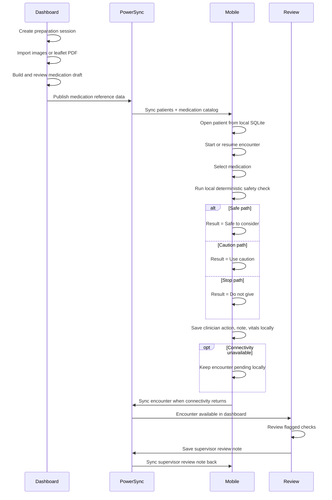
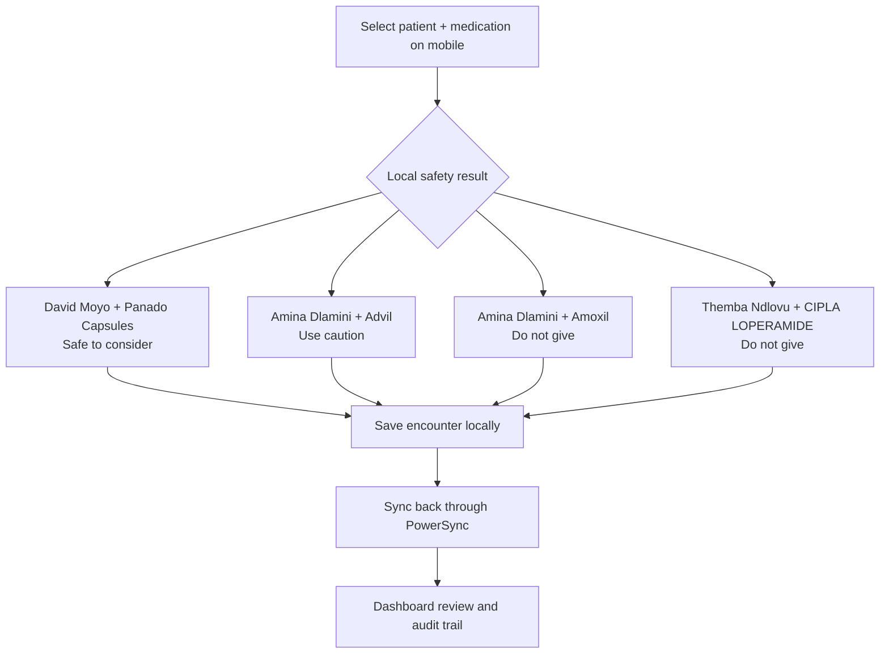

# AidSync

AidSync is an offline-first medication safety system for clinicians working in low-connectivity environments.

The current product is built around one core loop:

1. `Prepare`
2. `Sync`
3. `Check`
4. `Record`
5. `Sync back`

Medication reference data is prepared online, synced to field devices through PowerSync, used locally during care, and synced back into a reviewable audit trail when connectivity returns.

## What Is Actually Built

### `aidsync_mobile`

The mobile app is the field-care surface.

Current implemented flow:

- sign in and unlock locally
- open synced patient records from local SQLite
- review allergies, conditions, current medications, and recent encounter context
- start or resume an encounter
- select a medication from the synced local catalog or create a custom local medicine entry
- run deterministic on-device safety checks automatically when a medication is selected
- record clinician action, notes, and vitals locally first
- sync encounter updates back later

Current implemented supporting features:

- local encounter drafts
- cancel draft encounter
- patient blood-pressure trend from local encounter history
- supervisor review note visibility after sync
- mutable patient pregnancy status/context

Not currently part of the mobile flow:

- live leaflet scanning on device
- active voice-note capture/transcription

### `aidsync_dashboard`

The dashboard is the online preparation and review surface.

Current implemented flow:

- manage medication reference data
- create medication preparation sessions
- ingest medication source material as:
  - page images
  - leaflet PDFs
  - leaflet PDF URLs when browser access allows it
- extract text into a review draft
- review and publish medication catalog data
- review synced encounters
- mark flagged medication checks as reviewed
- add supervisor review notes to encounters

Current implemented review surfaces:

- overview / operational dashboard
- medication catalog
- ingredients
- interactions
- contraindications
- patient directory
- encounter queue and encounter detail

Not currently represented as core product behavior:

- AI-generated clinical summaries
- decorative audit/evidence panels without real workflow value

## What AidSync Is Not

AidSync is not:

- a diagnosis engine
- an autonomous prescribing system
- a full EMR
- a replacement for clinician judgment

The product is a clinical safety assist plus field workflow tool.

## System Architecture

### Mobile Runtime

- `Flutter`
- `PowerSync` client with local SQLite
- deterministic Dart medication safety rules
- local-first encounter writes

### Dashboard Runtime

- `React` / `Vite`
- Supabase-backed preparation and review workflows
- `TanStack AI` available in the dashboard stack for preparation and review helpers
- medication catalog and rule management
- encounter audit and supervisor review

### Backend Runtime

- `Supabase Auth`
- `Supabase Postgres`
- `Supabase Storage`
- `PowerSync Sync Streams`
- Supabase Edge Function support for preparation workflows
- `aidsync_ocr_api` as a supporting OCR/extraction service for preparation workflows

The OCR API supports preparation and extraction work on the online side. It is not part of the critical on-device medication safety decision path.

## Sponsor Tech Notes

This project uses sponsor technologies in different roles:

- `PowerSync` is central to the product architecture
- `TanStack Router` and `TanStack Query` power the dashboard application shell
- `TanStack AI` is included in the dashboard stack for optional preparation and
  review assistance

Important boundary:

- `TanStack AI` is not used as the medication safety decision engine
- the mobile safety result still comes from deterministic on-device rules

## Why PowerSync Matters

PowerSync is central to the product, not incidental infrastructure.

It is what makes the demo credible:

- patient data is queryable locally on the device
- medication reference data is available offline
- encounter writes succeed while offline
- local safety checks run against local patient and medication data
- dashboard review receives synced results later

## Current Demo Flow

1. Open the dashboard online
2. Prepare or review medication reference data
3. Publish medication reference data
4. Sync the data to the mobile device through PowerSync
5. Open a patient on the mobile app from local SQLite
6. Start an encounter
7. Select a medication and let the local rules engine return a result
8. Save the clinician decision locally
9. Continue offline if needed
10. Restore connectivity
11. Review the synced encounter in the dashboard

## Golden Path Diagrams

### End-to-End Workflow



### Sync And Review Sequence



### Seeded Demo Outcomes



## Current Workspace Layout

```txt
aidsync_dashboard/       Online medication preparation and review surface
aidsync_mobile/          Flutter mobile app for field clinicians
aidsync_ocr_api/         OCR/extraction support service
powersync/               PowerSync sync rules and notes
supabase/                Supabase config, migrations, functions, and seed data
```

## Running The Main Surfaces

The main repo contains two primary product surfaces:

- `aidsync_dashboard`
  - online medication preparation and review
  - run with the dashboard dev workflow in that folder
- `aidsync_mobile`
  - Flutter field app
  - run with the Flutter workflow in that folder

Supporting infrastructure in this repo:

- `supabase/`
  - schema, seed data, functions
- `powersync/`
  - sync rules and notes
- `aidsync_ocr_api/`
  - supporting OCR/extraction service for preparation flows

## Getting Started

### 1. Start the backend dependencies

From the repo root:

```bash
supabase start
```

If you need a clean local database with the current demo dataset:

```bash
supabase db reset --local
```

### 2. Run the dashboard

```bash
cd aidsync_dashboard
npm install
npm run dev
```

The dashboard runs at:

- [http://localhost:5173](http://localhost:5173)

### 3. Run the mobile app

```bash
cd aidsync_mobile
flutter pub get
flutter run
```

Use a device or emulator with access to the local Supabase/PowerSync environment you are targeting.

### 4. Optional supporting OCR service

If you want the OCR/extraction support service running locally:

```bash
cd aidsync_ocr_api
python3 -m venv .venv
source .venv/bin/activate
pip install -r requirements.txt
uvicorn app.main:app --reload
```

### 5. Recommended demo order

1. start Supabase
2. start the dashboard
3. start the mobile app
4. confirm medication reference data exists in the dashboard
5. confirm the mobile app has synced patients and medications
6. run one encounter flow and review the synced result back in the dashboard

## Current Scope Discipline

The strongest version of AidSync today is:

An offline-first medication safety system where medication reference data is prepared online, synced to devices through PowerSync, used locally during disconnected care sessions, and synced back into a reviewable audit trail.

That means current scope is intentionally tight:

- no mobile leaflet scanning workflow
- no voice transcription dependency in the critical path
- no fake AI decision-making
- no decorative audit features without operational meaning

## Tech Stack

- `Flutter` for the mobile app
- `React` + `Vite` for the dashboard
- `PowerSync` for local SQLite sync using Sync Streams
- `Supabase` for Auth, Postgres, Storage, and Edge Functions
- `Dart` rules engine for deterministic medication safety checks
- `Python` for tooling and experiments
