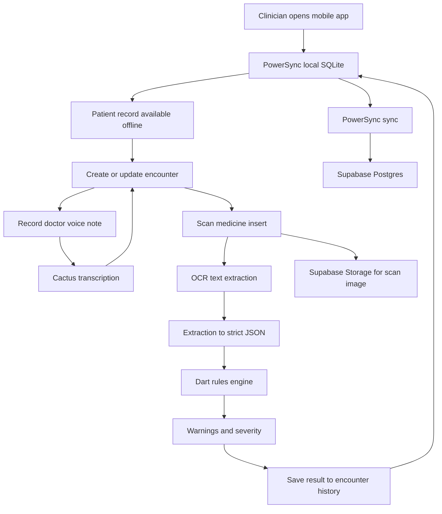

# Architecture / Workflow

## High-Level Workflow

1. Patient data is synced from Supabase/Postgres to local SQLite via PowerSync.
2. Clinician opens patient record from local data, even when offline.
3. Clinician records encounter details locally.
4. Clinician records a voice note during or after treatment.
5. Clinician scans a medicine insert.
6. OCR extracts text from the insert.
7. Extraction layer converts OCR text into strict medication JSON.
8. Dart rules engine checks the extracted medication information against patient context.
9. Warning results are saved into local encounter history.
10. PowerSync syncs new and updated records back to Supabase when connectivity returns.

---

## System Components

- **Flutter app**: mobile UI, camera flow, voice-note flow, local-first experience
- **PowerSync client**: local SQLite + sync layer
- **Supabase Postgres**: system of record
- **Supabase Storage**: insert images / attachments
- **Cactus**: hybrid voice transcription and note capture
- **OCR layer**: extract raw text from insert
- **Extraction layer**: strict medication JSON
- **Dart rules engine**: deterministic safety checks
- **Python tools**: fixture generation, OCR experiments, demo prep

---

## Data Flow Diagram

---

## Safety Check Logic

### Inputs
- patient allergies
- patient conditions
- current medications
- extracted medication insert JSON

### Checks
- allergy overlap
- ingredient duplication
- explicit interaction conflicts
- condition contraindications
- pregnancy / lactation caution
- age-related warnings

### Outputs
- warning list
- severity band
- clinician review action
- saved audit trail in encounter history

---

## Sync Model

### Synced entities
- patients
- allergies
- conditions
- current medications
- encounters
- vitals
- scanned insert metadata
- interaction checks
- attachment metadata
- voice note metadata / transcripts

### Local-first behavior
- reads should prefer local SQLite
- writes should commit locally first
- sync should be visible but not blocking
- warning results must remain accessible offline

---

## Why PowerSync Matters

Without PowerSync:
- patient history would depend on request/response availability
- encounter capture becomes fragile in poor connectivity
- safety checks tied to patient context become harder to trust in the field

With PowerSync:
- the app behaves like a local system first
- sync becomes background infrastructure
- clinicians can keep working when the network is unstable

---

## Runtime Split

### Runs on mobile device
- Flutter UI
- local SQLite via PowerSync
- Dart rules engine
- core encounter workflow
- local notes, scans, and safety checks

### Runs in backend / cloud
- Supabase Auth
- Supabase Postgres
- Supabase Storage
- optional Edge Function fallback processing

### Runs as tooling, not product runtime
- Python scripts for seed data, fixtures, OCR tests, and demo prep
