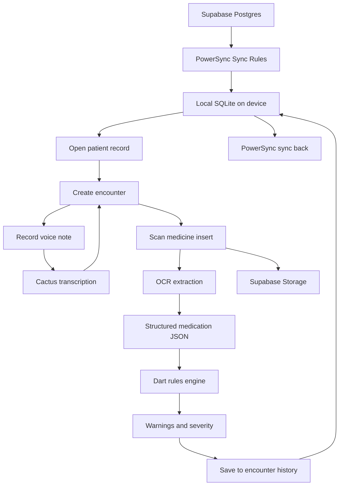

# AidSync

**AidSync** is an offline-first field care app for clinicians working in low-connectivity environments.

It helps clinicians:
- access patient records offline
- capture encounters locally
- record doctor voice notes during or after treatment
- scan medicine inserts / leaflets
- extract structured medication safety data
- check that data against patient allergies, conditions, and current medications
- save the result into patient history
- sync everything later with **PowerSync**

---

## Why this exists

In field settings, connectivity is often unreliable at exactly the wrong moment.

AidSync is built for those moments.

Instead of making clinicians depend on round-trip network requests to review patient history or store updates, AidSync keeps the workflow local-first. Medication safety checks are tied directly to patient context, and records sync when the connection returns.

---

## Core Idea

**Scan. Check. Record. Sync.**

A clinician can:
1. open a patient record from local storage
2. record notes by voice while treating the patient
3. scan a medicine insert
4. structure the insert into medication metadata
5. run a safety check against patient context
6. save the result into encounter history
7. continue working offline

---

## Stack

- **Flutter** — mobile app
- **Supabase** — backend (Auth, Postgres, Storage)
- **PowerSync** — local SQLite sync layer
- **Cactus** — hybrid doctor note transcription
- **Dart rules engine** — deterministic medication safety checks
- **Python** — tooling, seed scripts, OCR experiments, fixture prep

---

## Sponsor Tech Fit

### Supabase
Used meaningfully for:
- authentication
- primary Postgres data store
- attachment storage
- optional Edge Functions for extraction fallback / post-sync processing

### PowerSync
Used meaningfully for:
- syncing patient records to local SQLite
- offline encounter writes
- syncing interaction check history
- keeping the app usable under unreliable connectivity

### Cactus
Used meaningfully for:
- hybrid on-device/cloud transcription of doctor voice notes
- quick note capture during field treatment
- optional transcription fallback under poor connectivity conditions

---

## What AidSync is not

AidSync is **not**:
- a diagnosis engine
- an autonomous prescribing system
- a full EMR
- a replacement for clinician judgment

It is a **clinical safety assist** and **field workflow tool**.

---

## Workflow

### 1. Patient sync
Patient data is synced from Supabase/Postgres into local SQLite through PowerSync.

### 2. Encounter capture
Clinician opens a patient record and records a new encounter locally.

### 3. Voice note capture
Clinician records a voice note during or after treatment. The note is transcribed and attached to the encounter.

### 4. Insert scan
Clinician scans a medicine insert or leaflet.

### 5. OCR and extraction
Raw text is extracted from the insert, then converted into structured medication JSON.

### 6. Safety check
A deterministic Dart rules engine compares the extracted medication data against:
- allergies
- current medications
- known conditions
- pregnancy / age flags where relevant

### 7. Save to history
Warnings and clinician actions are stored in the encounter record.

### 8. Later sync
PowerSync syncs updates back to Supabase when the network is available.

---

## Data Flow



---

## Example Safety Check

### Patient context
- allergy: penicillin
- current medication: warfarin
- condition: pregnancy

### Scanned insert extraction
- active ingredient: amoxicillin
- interaction warning: anticoagulants
- pregnancy warning present

### Expected result
- severe allergy warning
- medication interaction warning
- pregnancy caution
- clinician review required

---

## Repo Layout

```txt
mobile/
backend/
  supabase/
tools/
docs/
README.md
```

---

## MVP Scope

### Must ship
- patient records
- encounter history
- voice note capture
- medication insert scan
- OCR text extraction
- strict JSON medication extraction
- deterministic safety checks in Dart
- offline-first writes
- sync via PowerSync

### Nice to have
- AI encounter summaries
- sync activity log
- handoff summaries
- small web review dashboard

---

## Demo Flow

1. Open app online and load patient list
2. Open patient detail from local SQLite
3. Start a new encounter
4. Record doctor voice note
5. Scan a medicine insert
6. Show extracted structured medication data
7. Run safety check
8. Save result into patient history
9. Turn connectivity off
10. Create or update another encounter offline
11. Turn connectivity back on and show sync

---

## Why PowerSync matters here

AidSync is not using PowerSync as a generic sync checkbox.

The product depends on local-first behavior:
- patient history must be available offline
- encounter writes must succeed without the network
- medication safety checks must remain attached to local patient context
- sync later must be predictable and reliable

---

## Future Direction

- broader insert support
- multilingual clinician summaries
- richer contraindication rules
- care-team handoff workflows
- audit / review dashboards
- configurable formularies per deployment
